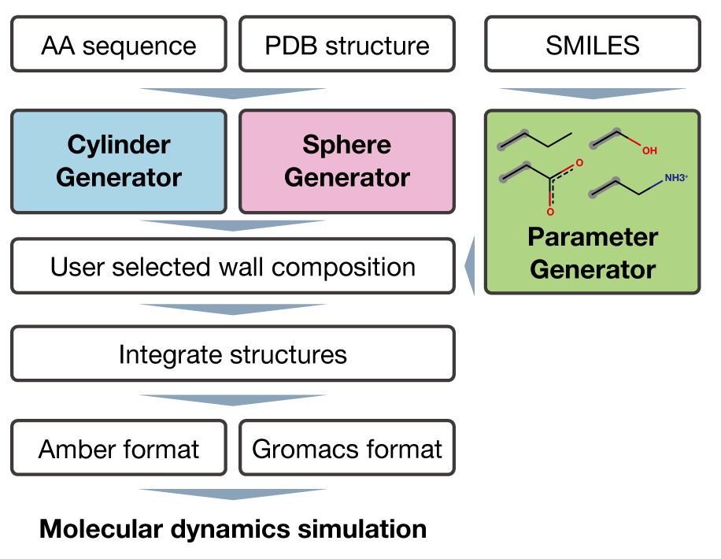

<p align="center"><br><br><br>
Cellular Environment Mimicking Model GENerator <br><br><br></p>

# Welcome to CEMM-GEN
<p align="center"><br></p>


## What is CEMM-GEN?

CEMM-GEN is a new tool aiming to generate cellular environment mimicking model for molecular dynamics simulation. CEMM-GEN provides a configuration with any modification group added to the spherical or cylinder-like interior. 
<br><br><br><br><br><br><br><br><br>

## Instllation 
```sh
conda create -n cemm-gen-env
conda activate cemm-gen-env
conda install -c conda-forge openbabel psi4 resp ambertools
pip install cemm-gen
```
## Basic Usage
```sh:available_sub-commands
# Make a cylindrical model
cemm-gen cylinder --proteinseq GASGASGASGAS --proteinSS HHHHHHHHHHHH --resnames MTY:HYD --composition 1:2.5

# Make a spherical model
cemm-gen sphere --proteinpdb protein.pdb --resnames MTY:HYD --composition 0.3:0.7

# Make parameters for a new residue
cemm-gen makeparam --smiles CCC --resname MTY --description "Methyl group"
```

**Please see the documentation [English](https://github.com/y4suda/CEMM-GEN/blob/main/tutorial_en.md) / [日本語](https://github.com/y4suda/CEMM-GEN/blob/main/tutorial_ja.md)**

## Version History
See the [version history](./version_history.md) for the latest updates.

## Cite Us
T. Yasuda, R. Morita, Y. Shigeta and R. Harada. "Cellular Environment Mimicking Model GENerator: A tool for generating a cellular environment mimicking model."*XXXX*,2024,XXXX,[doi](https://XXX)

## Authors
Takunori Yasuda, Doctoral Program in Biology, University of Tsukuba
Rikuri Morita, Center for Computational Sciences, University of Tsukuba  
Yasuteru Shigeta, Center for Computational Sciences, University of Tsukuba  
Ryuhei Harada, Center for Computational Sciences, University of Tsukuba  
yasuda.takunori.tkb_gb@u.tsukuba.ac.jp 
