<p align="center"><br><br><br>
Cellular Environment Mimicking Model GENerator<br><br><br></p>

# Welcome to CEMM-GEN
<p align="center"><br>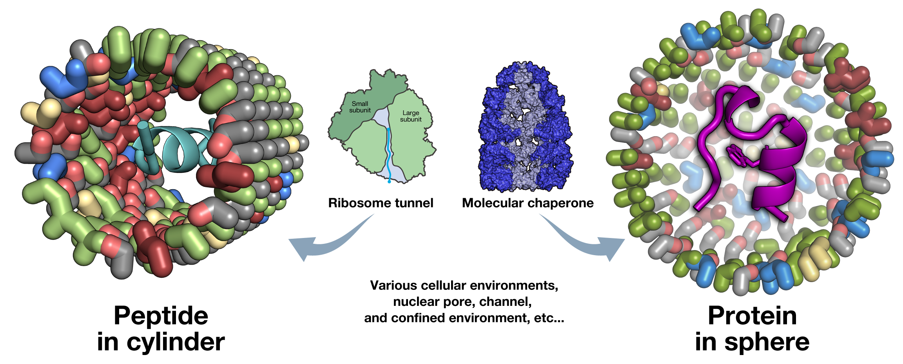</p>

# Tutorial

## Installation
```sh
conda create -n cemm-gen-env
conda activate cemm-gen-env
conda install -c conda-forge openbabel psi4 resp ambertools
pip install cemm-gen
```

To install from GitHub repository, use the following command.
```sh
git clone https://github.com/y4suda/CEMM-GEN.git
pip install ./CEMM-GEN
```

## Basic Usage
```sh:available_sub-commands
# Make a cylindrical model
cemm-gen cylinder

# Make a spherical model
cemm-gen sphere

# Make parameters for a new residue
cemm-gen makeparam

# Show available parameters
cemm-gen listparam
```

## 🔭 Make a cylindrical model

```sh:quick_example
cemm-gen cylinder --proteinseq GASGASGASGAS --proteinSS HHHHHHHHHHHH --resnames MTY:HYD --composition 1:2.5
```

## 🌐 Make a spherical model

```sh:quick_example
cemm-gen sphere --proteinpdb protein.pdb --resnames MTY:HYD --composition 0.3:0.7
```

##

## 🍳 Protein structure input or generation
CEMM-GEN can place a protein structure in the generated model. There are two ways to specify a protein structure.

1. Specify a .pdb file `--proteinpdb`

    A .pdb file containing a protein structure can be specified.

2. Specify an amino acid sequence and the secondary structure `--proteinseq` and `--proteinSS`

    The structure is automatically generated using the tleap program in Ambertools. The amino acid sequence should be provided in one-letter code.
    Only straight chain (coil) `C` or helix `H` are allowed as secondary structures. An error will be returned if the amino acid sequence does not match the length.

[!TIP]
In either case, the long and short axes of the protein are automatically calculated and reflected in the model size.
If `--length` of `cylinder` is specified and the protein protrudes, a warning is issued, but the structure generation is allowed.
Please check the final structure carefully.
If `--radius` is specified, an error will be returned if the protein size protrudes.
To create a model that fits the size of the protein, use `--padding-radius`.

## 🎨 Specify the chemical properties within models 
CEMM-GEN can specify probability of the functional residues. 

1. Specify residue type `--resnames XXX:YYY:ZZZ:..`

2. Speficy residue populations `--resnames i:j:k:..`

3. (Optinal） Specify min-distance between each residues 　　`--min-distance　i [Å]　(defalt:4.0)`

## 🚀 Output
CEMM-GEN finally generate the input files for MD simulation in AMBER (. prmtop, .inpcrd) or GROMACS (.top, .gro) format.

##


## 📖 List of available residue parameters

The list of available residues can be obtained with the `listparam` subcommand.

```sh:quick_example
cemm-gen listparam
```

If you add the `--dump` option, the list of available residues will be output as an HTML file.


## 💻 Make parameters for a new residue

To create a new residue parameter, use the `makeparam` subcommand.

```sh:quick_example
cemm-gen makeparam --smiles CCC --resname MTY --description "Methyl group"
```

### Minimal required options
- Chemical structure in SMILES format `--smiles`
  - The first two atom should be carbon atoms to apply the position restraint. (OK: CCN; NG: CN)
- Residue name `--resname`
  - Please name the residue with a three-letter name that does not conflict with the already used amino acid residue names.
- Description `--description`
  - Please enter a description when registering a residue.

### Skip structure optimization
CEMM-GEN uses the ETKDGv3 method of RDKit to generate structures, and then optimizes them with the functional specified by `--method-opt` and `--basisSet-opt`.
If you want to skip this step (e.g., if the structure optimization is not completed), run it with the `--singlePoint` option.

### Charge setting
If the residue has a charge, specify the charge with the `--netcharge` option.
If the charge is not zero, add the `--no-neutralize` option.
For carboxy groups with negative charges, please specify the aromatic bond `:` in the SMILES. Example: `CCC(:O):O`

### Settings related to effective execution
`--num-thread` specifies the number of threads to use. `--memory-sizeGB` specifies the available memory size.
If all cores and memory of the machine are used, other operations may not be possible, so set them with sufficient margin.

### Re-build a existing residue
If you want to re-build an existing residue, please specify `--overwrite`. The default system residue cannot be modified, but the residue in the current directory takes precedence.


## List of the default residues
<div width="100%">
<div style="width: 164px; display: inline-block">
<br>BLA<br>(Blank group)<br>CCCC<br>
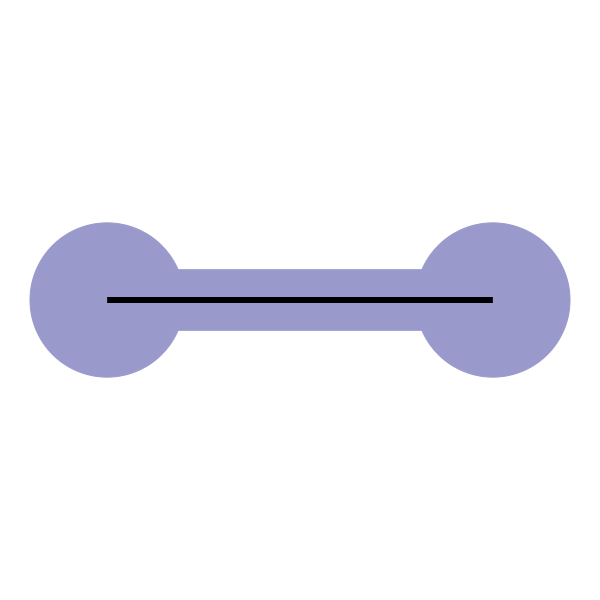
</div>
<div style="width: 164px; display: inline-block">
<br>MTY<br>(Methyl group)<br>CCC<br>
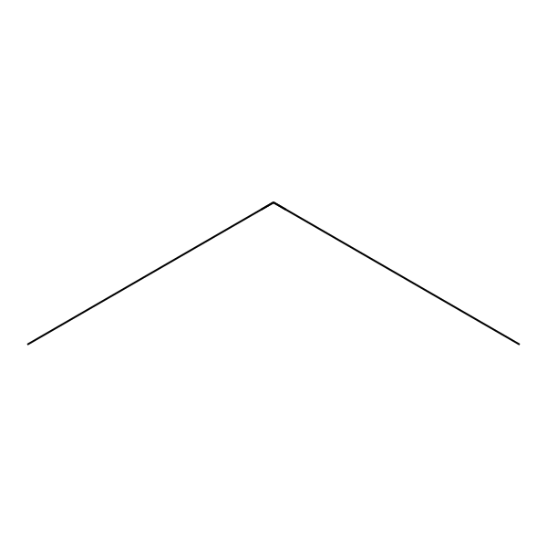
</div>
<div style="width: 164px; display: inline-block">
<br>ETY<br>(Ethyl group)<br>CCCC<br>
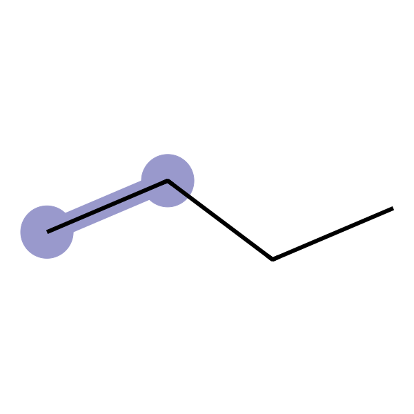
</div>
<div style="width: 164px; display: inline-block">
<br>HYD<br>(Hydroxy group)<br>CCO<br>
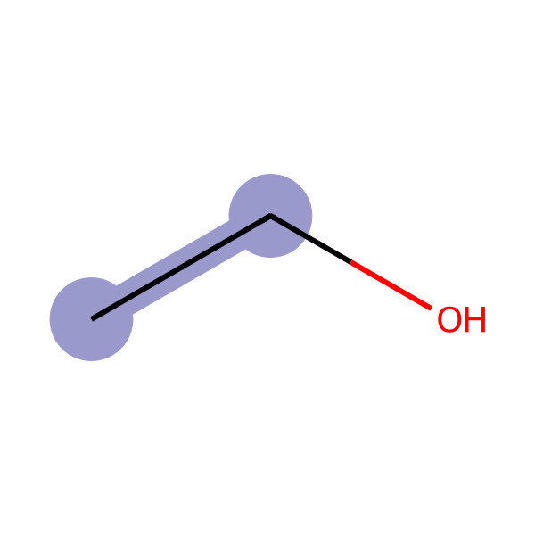
</div>
<div style="width: 164px; display: inline-block">
<br>CBO<br>(Carboxy group)<br>CCO<br>
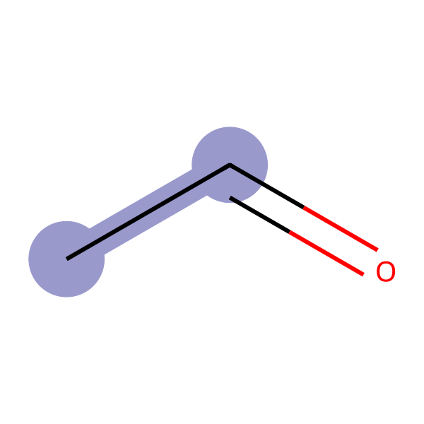
</div>
<div style="width: 164px; display: inline-block">
<br>MTO<br>(Methoxy group)<br>CCO<br>
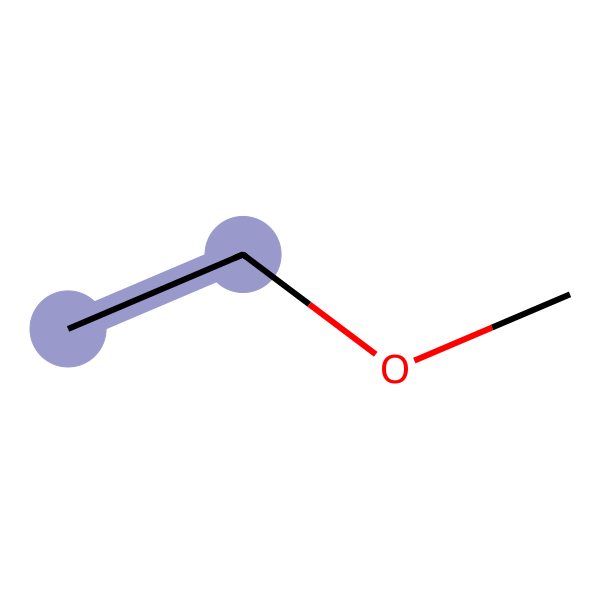
</div>
<div style="width: 164px; display: inline-block">
<br>ARM<br>(Aromatic group)<br>CCc1ccccc1<br>
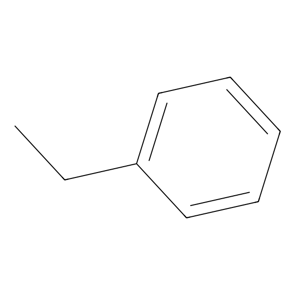
</div>
<div style="width: 164px; display: inline-block">
<br>ARO<br>(Tyrosine-like group)<br>CCc1ccc(O)cc1<br>
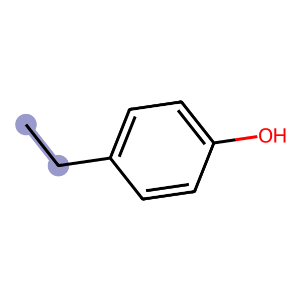
</div>
<div style="width: 164px; display: inline-block">
<br>NEG<br>(Negatively charged carboxy group)<br>CCC(:O):O<br>
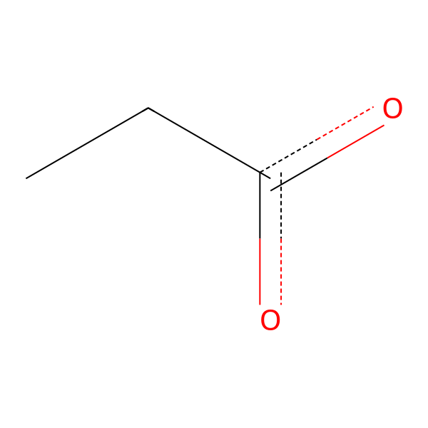
</div>
<div style="width: 164px; display: inline-block">
<br>POS<br>(Positively charged amino group)<br>CC[NH3+]<br>
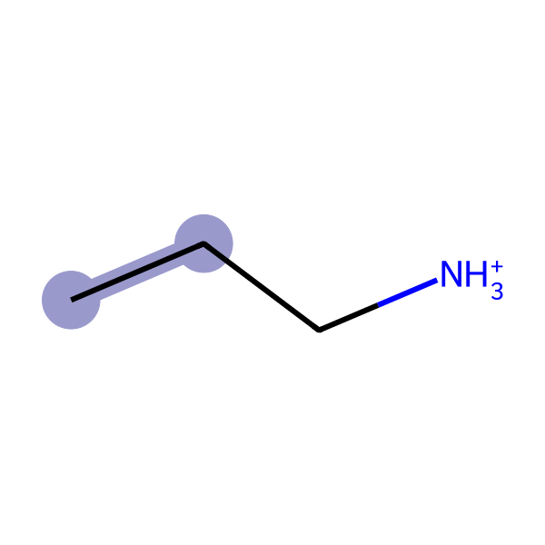
</div>
<div style="width: 164px; display: inline-block">
<br>THI<br>(Thiol group)<br>CCS<br>
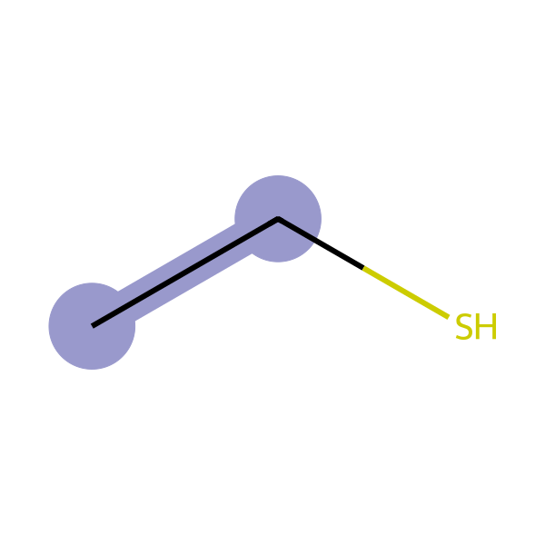
</div>
<div style="width: 164px; display: inline-block">
<br>THE<br>(Thiolate group)<br>CC[S-]<br>
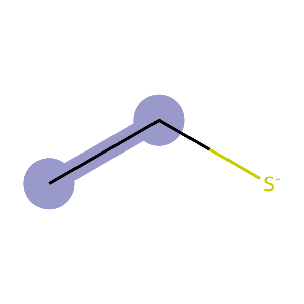
</div>
<div style="width: 164px; display: inline-block">
<br>MTI<br>(Methionine group)<br>CCSC<br>
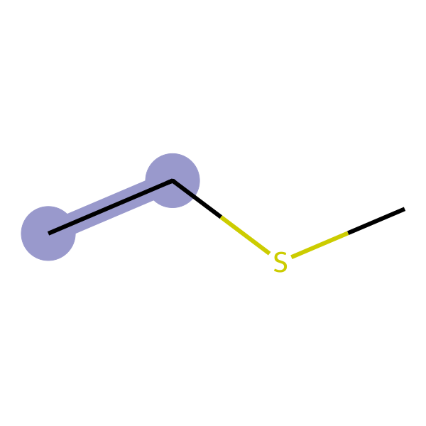
</div>
<div style="width: 164px; display: inline-block">
<br>GUA<br>(Guanidino group)<br>CCNC(N)N<br>
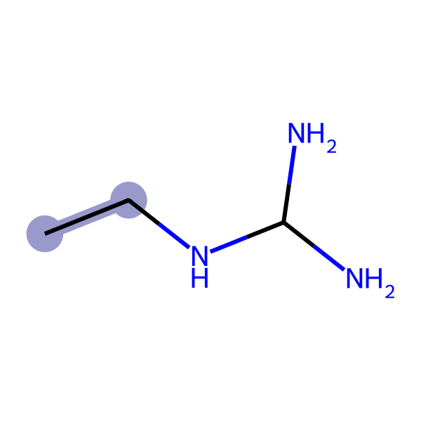
</div>
</div>


## Citation
If you use this program to create papers or other documents, please cite the following literature as much as possible.

Takunori Yasuda, Rikuri Morita, Yasuteru Shigeta, Ryuhei Harada. (2024) Cellular Environment Mimicking Model GENerator: A tool for generating a cellular environment mimicking model. Submitted.
