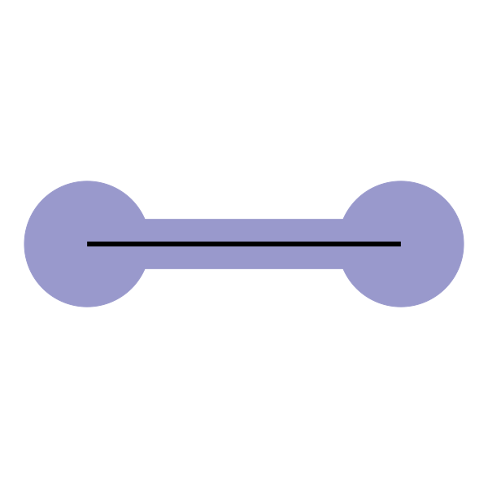
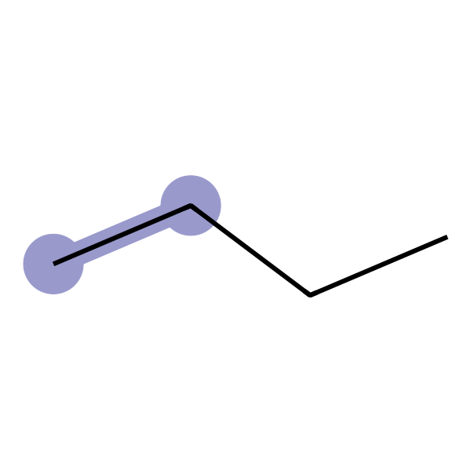

<p align="center"><br><br><br>
Biomolecular Environment Mimicking Model GENerator<br><br><br></p>

# Welcome to BEMM-GEN
<p align="center"><br></p>

# チュートリアル

## インストール方法
```sh
conda create -n bemm-gen-env
conda activate bemm-gen-env
conda install -c conda-forge openbabel psi4 resp ambertools
pip install bemm-gen
```

GitHubリポジトリからインストールする場合は、以下のコマンドを使用してください。
```sh
git clone https://github.com/y4suda/BEMM-GEN.git
pip install ./BEMM-GEN
```

## 基本的な使い方
```sh:available_sub-commands
# 円筒形のモデルを作成
bemm-gen cylinder

# 球形のモデルを作成
bemm-gen sphere

# 壁面の残基を作成
bemm-gen makeparam

# 使用可能な残基一覧を表示
bemm-gen listparam
```

## 🔭 円筒形のモデル作成

```sh:quick_example
bemm-gen cylinder --proteinseq GASGASGASGAS --proteinSS HHHHHHHHHHHH --resnames MTY:HYD --composition 1:2.5
```

## 🌐 球形のモデル作成

```sh:quick_example
bemm-gen sphere --proteinpdb protein.pdb --resnames MTY:HYD --composition 0.3:0.7
```

## 

## 🍳 タンパク質構造の入力または生成
BEMM-GEN では生成したモデル内にタンパク質を配置できます。タンパク質の指定方法は２種類です。

1. pdbファイルを指定する `--proteinpdb`

    任意のタンパク質構造を含む構造ファイルを指定できます

2. アミノ酸配列と二次構造を指定する `--proteinseq` および `--proteinSS`

    Ambertools の tleap プログラムを使用して構造を自動生成します。アミノ酸配列は１文字表記で入力してください。
    二次構造は直鎖（コイル） `C` もしくはヘリックス `H` のみが使用できます。アミノ酸配列と長さが一致しない場合はエラーが返されます。

[!TIP]
いずれの場合も、タンパク質の長径、短径は自動で計算されモデルの大きさに反映されます。`cylinder` の `--length` を指定した場合タンパク質がはみ出す場合は警告が出されますが、構造生成は許容されます。最終的な構造をよく確認してください。`--radius` を指定した場合、タンパク質の大きさがはみ出すことは許容されないため、エラーを返し終了します。タンパク質のサイズに合わせたモデルを作るには `--padding-radius` を活用してください。

## 🎨 モデル内部における組成の決定
BEMM-GEN ではモデル内に配置する残基の組成を指定することができます。

1. 残基の種類を指定する `--resnames XXX:YYY:ZZZ:..`

2. 各残基の割合を指定する `--resnames i:j:k:..`

3. (オプション） 残期間の最小距離を指定する　　`--min-distance x [Å] (defalt:4.0)`

## 🚀出力
BEMM-GENでは、AMBER（.prmtop, .inpcrd）またはGROMACS（.top, .gro）形式でMDシミュレーションの入力ファイルを生成します。

## 🖥 MDシミュレーションの実行
生成されたファイルを使用して、MDシミュレーションを実行してください。

### GROMACS の場合
モデルについての位置拘束はすでに .top ファイルに設定されています。
緩和計算中にタンパク質が動かないように位置拘束をかけるため、.mdp ファイルに以下の設定を追加してください。
```sh:quick_example
define = -DPROTEINPOSRES
```

### AMBER の場合
モデルについての位置拘束は、ログを参考にして .in ファイルに設定してください。
緩和計算中のタンパク質についても同様に .in ファイルに設定して位置拘束をかけてください。


## 📖 パラメーターの一覧

現在利用可能な残基一覧は `listparam` サブコマンドで取得できます。

```sh:quick_example
bemm-gen listparam
```

`--dump` オプションを付けると利用可能な残基の一覧をHTMLファイルで出力します。

## 💻 パラメーターの作成

独自の残基を作る場合は `makeparam` サブコマンドを使用してください。

```sh:quick_example
bemm-gen makeparam --smiles CCC --resname MTY --description "Methyl group"
```

### 最低限必要な入力
- SMILES表記の化合物構造 `--smiles`
  - 位置拘束をかけるため、必ず２つの炭素で開始してください。(OK: CCN; NG: CN)
- 残基名 `--resname`
  - すでに利用されているアミノ酸残基名と被らないように、３文字で名前をつけてください。
- 説明 `--description`
  - 残基を登録する際の説明を入力してください。

### 構造最適化を省略する場合
Rdkit の ETKDGv3 法で構造生成を行った後、`--method-opt` と `--basisSet-opt` で指定された基底関数で最適化を行います。
これを省略する場合（構造最適化が完了しないなど）、`--singlePoint` オプションを付けて実行してください。

### 電荷をもつ残基の場合
`--netcharge` オプションに電荷を指定してください。電荷がゼロでない場合は、`--no-neutralize` オプションを付けてください。
負電荷を持つカルボキシ基などは芳香族結合 `:` をSMILESに明記してください。 例：`CCC(:O):O`

### 実行速度に関する設定
`--num-thread` には使用するスレッド数を指定してください。`--memory-sizeGB` には使用可能なメモリサイズを指定してください。いずれもマシンの全コア、メモリを使用すると他の操作ができなくなる場合があるので、適宜余裕をもって設定してください。

### すでにある残基を作り直す場合
`--overwrite` を指定してください。システムデフォルトの残基は修正できませんが、カレントディレクトリの残基が優先されます。


## デフォルトパラメーターの一覧
<div width="100%">
<div style="width: 164px; display: inline-block">
<br>BLA<br>(Blank group)<br>CCCC<br>

</div>
<div style="width: 164px; display: inline-block">
<br>MTY<br>(Methyl group)<br>CCC<br>

</div>
<div style="width: 164px; display: inline-block">
<br>ETY<br>(Ethyl group)<br>CCCC<br>

</div>
<div style="width: 164px; display: inline-block">
<br>HYD<br>(Hydroxy group)<br>CCO<br>

</div>
<div style="width: 164px; display: inline-block">
<br>CBO<br>(Carboxy group)<br>CCO<br>

</div>
<div style="width: 164px; display: inline-block">
<br>MTO<br>(Methoxy group)<br>CCO<br>

</div>
<div style="width: 164px; display: inline-block">
<br>ARM<br>(Aromatic group)<br>CCc1ccccc1<br>

</div>
<div style="width: 164px; display: inline-block">
<br>ARO<br>(Tyrosine-like group)<br>CCc1ccc(O)cc1<br>

</div>
<div style="width: 164px; display: inline-block">
<br>NEG<br>(Negatively charged carboxy group)<br>CCC(:O):O<br>

</div>
<div style="width: 164px; display: inline-block">
<br>POS<br>(Positively charged amino group)<br>CC[NH3+]<br>

</div>
<div style="width: 164px; display: inline-block">
<br>THI<br>(Thiol group)<br>CCS<br>

</div>
<div style="width: 164px; display: inline-block">
<br>THE<br>(Thiolate group)<br>CC[S-]<br>

</div>
<div style="width: 164px; display: inline-block">
<br>MTI<br>(Methionine group)<br>CCSC<br>

</div>
<div style="width: 164px; display: inline-block">
<br>GUA<br>(Guanidino group)<br>CCNC(N)N<br>

</div>
</div>


## 引用
このプログラムを利用して論文等を作成する際は、可能な範囲で以下の文献を引用してください。

Takunori Yasuda, Rikuri Morita, Yasuteru Shigeta, Ryuhei Harada. (2024) BEMM-GEN: A toolkit for generating a biomolecular environment mimicking model. Submitted.
